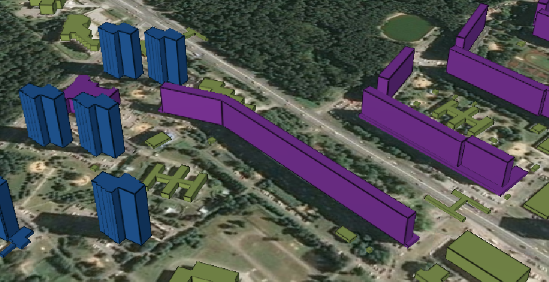

# Интересные особенности cesium@1.95
1. [О стилях 3d-tiles ](#--3d-tiles)
2. [На будущее](#ex)
3. [На будущее](#ex)
4. [На будущее](#ex)


## О стилях 3d-tiles 

Источником послужила ссылка https://cesium.com/platform/cesium-ion/content/cesium-osm-buildings/

Если вы знакомы со статьей https://github.com/CesiumGS/3d-tiles/tree/main/specification/Styling, то ничего нового вы не найдете

| Свойство                  | Description                                         |
|---------------------------|-----------------------------------------------------|
| elementId                 | Идентификатор здания. Для показа или скрытия здания |
| *cesium#estimatedHeight*	 | Высота здания                                       |



например, если требуется менять цвет зданию исходя из высоты, так написать НЕЛЬЗЯ:
```json
 ["${cesium#estimatedHeight} > 20", "color('#953ead')"] 
```

*что же нужно: добавить в defines новую переменную*,
```json 
${feature['cesium#estimatedHeight']} 
``` 
и использовать новую переменную
```javascript
 ["${newHeight} > 60", "color('#0765A9')"]
```
          или
```javascript
 ["feature['cesium#estimatedHeight'] > 60", "color('#0765A9')"]
```
полный код:

```javascript 
    buildingTileset.style = new Cesium.Cesium3DTileStyle({
      defines: {
        newHeight: "${feature['cesium#estimatedHeight']}"
      },
      color: {
        conditions: [
          ["${newHeight} > 90", "color('#c79228')"],
          ["${newHeight} > 60", "color('#0765A9')"],
          ["${newHeight} > 45", "color('#751a37')"],
          ["${cesium#estimatedHeight} > 20", "color('#953ead')"],
          ["true", "color('#abb85c')"]
        ],
      },
    }); 
```

## еще об важном, писать вышеупомянутый код в таком стиле <ins>**НЕЛЬЗЯ**</ins>:
надо перевернуть данный код задом наперед

поскольку важен порядок
```javascript
          ["${newHeight} > 20", "color('#953ead')"],
          ["${newHeight} > 45", "color('#751a37')"],
          ["${newHeight} > 60", "color('#0765A9')"],
          ["${newHeight} > 90", "color('#c79228')"],
```
